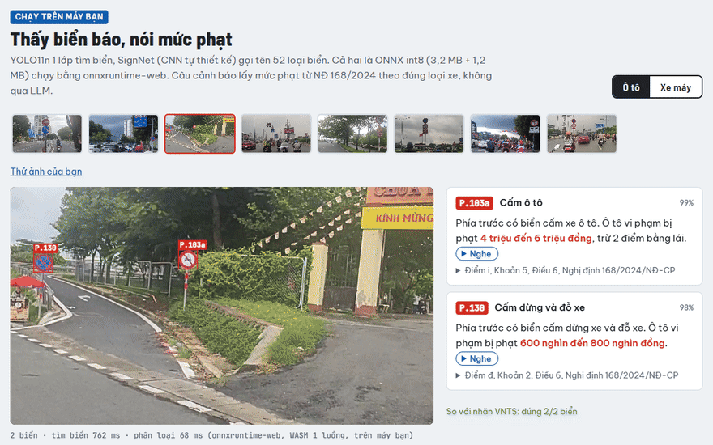

# viet-copilot

[](https://github.com/DuongCodeAI/viet-copilot/actions/workflows/ci.yml)
[](LICENSE)

[](https://duongcodeai.github.io/viet-copilot/)

<p align="left">
     
</p>

Trợ lý lái xe tiếng Việt **chạy offline trên laptop không GPU** (Ryzen 5 5625U, 16GB RAM):
nghe lệnh bằng giọng nói, nhìn biển báo qua camera hành trình, theo dõi tài xế buồn ngủ, và tra luật giao thông.

### ▶ [Demo trên trình duyệt: duongcodeai.github.io/viet-copilot](https://duongcodeai.github.io/viet-copilot/)

| phần | trong demo | |
|---|---|---|
| [Biển báo → mức phạt](https://duongcodeai.github.io/viet-copilot/#/signs) | 2 model ONNX int8 (4,4 MB) **chạy thật trên máy bạn**; chọn ảnh mẫu hoặc tải ảnh lên, đổi ô tô / xe máy, nghe câu cảnh báo | chạy thật |
| [Buồn ngủ](https://duongcodeai.github.io/viet-copilot/#/drowsy) | webcam → MediaPipe → EAR/PERCLOS (cùng thuật toán với `drowsiness.py`, đã so khớp 1.200/1.200 frame), nhắm mắt 1,5 s là báo động | chạy thật |
| [Lệnh giọng nói](https://duongcodeai.github.io/viet-copilot/#/voice) | 11 lệnh qua STT → Qwen3-1.7B → guard → xe giả lập → TTS, nghe được cả wav vào lẫn câu trả lời, latency từng bước | output thật ghi trên laptop (model 1 GB) |

[](https://duongcodeai.github.io/viet-copilot/)

<sub>Ảnh mẫu thuộc tập test của VNTS (model chưa thấy lúc train). Đổi ô tô → xe máy: biển "cấm ô tô" chỉ còn đọc tên,
mức phạt "cấm dừng đỗ" đổi theo Điều 7. Ảnh cuối: model bỏ sót biển "cấm xe tải" ở xa, demo vẫn ghi ra.</sub>

> **English summary.** An offline Vietnamese driving assistant that ties four component repos together on a CPU-only
> laptop: an asyncio event bus with priorities (drowsiness > traffic sign > voice command), PhoWhisper speech-to-text,
> Piper TTS, EAR/PERCLOS drowsiness detection, traffic-sign warnings that cite the actual fine (no LLM in that path),
> and a fine-tuned 1.7B model for tool calling. Honest status: a voice command takes ~5.6-6 s end-to-end on CPU
> (STT ~3.4 s + LLM ~2.1 s), well above the 1.5 s target; fine-tuning STT on noisy audio made it *worse*, so the
> original PhoWhisper is used. **Live demo:** https://duongcodeai.github.io/viet-copilot/ (sign recognition and
> drowsiness detection run in your browser; voice commands are recorded real outputs).

Một phần của bộ 5 dự án [Trợ lý lái xe tiếng Việt chạy offline](https://github.com/DuongCodeAI) · tác giả: Tiến Dương.

## Kết quả chính

| | kết quả | ghi chú |
|---|---|---|
| cảnh báo biển báo đúng mức phạt (52 mã biển × 2 loại xe) | **88/104** cặp | trước khi sửa bug: 15/104; 16 cặp còn lại là biển chỉ dẫn/biển phụ |
| STT PhoWhisper-small int8 trên laptop, WER VIVOS | **2.78%** sạch / 5.95% ồn 10 dB | tiny nhanh hơn 6 lần nhưng sai gấp ~4 lần |
| fine-tune STT với tiếng ồn | WER sạch 2.14% → 3.13% | **kém hơn** bản gốc, nên không dùng |
| lệnh giọng nói end-to-end (CPU) | **~5.6-6 s** | **chưa đạt** mục tiêu 1.5 s; STT là nút thắt |
| function calling Qwen3-1.7B Q4 (fine-tune) | p50 ~1.9-2.2 s | |
| hỏi luật khi offline (không LLM viết câu trả lời) | đọc đúng mức phạt + điểm trừ theo loại xe | trước đây chỉ nói "không gọi được LLM" |

## Kiến trúc

```
[camera đường] ─► vn-dashcam-vision ─► "sign" ──┐
[camera cabin] ─► MediaPipe + EAR/PERCLOS ─► "drowsy" ─┤
[micro] ─► PhoWhisper (int8) ─► "speech" ──────────────┤
                                                        ▼
                                  EventBus (ưu tiên: buồn ngủ > biển báo > lệnh)
                                                        ▼
                                                    Copilot
              ┌───────────────────────┬─────────────────┴──────────────────┐
     lệnh giọng nói              biển báo                           buồn ngủ
  vi-function-calling-slm     vn-traffic-law-rag              gợi ý dừng nghỉ /
  (Qwen3-1.7B GGUF) ─► tool   lookup_sign -> mức phạt          cảnh báo khẩn
  (điều hoà, cửa, đèn, ...)   (regex, không qua LLM)
                                                        ▼
                                                 Piper TTS (tiếng Việt)
```

Ghép 4 repo thành phần:

| repo | vai trò |
|---|---|
| [vn-traffic-law-rag](https://github.com/DuongCodeAI/vn-traffic-law-rag) | tra luật, biển báo -> điều khoản xử phạt |
| [vn-dashcam-vision](https://github.com/DuongCodeAI/vn-dashcam-vision) | nhận diện biển báo, phát sự kiện sau khi nhiều frame đồng ý |
| [vi-diacritics-transformer](https://github.com/DuongCodeAI/vi-diacritics-transformer) | thêm dấu cho lệnh gõ không dấu (chỉ để LLM hiểu lệnh; tra luật dùng câu gốc vì restorer hay sai từ khoá luật) |
| [vi-function-calling-slm](https://github.com/DuongCodeAI/vi-function-calling-slm) | "bộ não" gọi tool, model 1.7B chạy offline |

### Quyết định thiết kế

- **Event bus bất đồng bộ**: camera ~10-15 fps không được chờ LLM 1-2 s. Mỗi nguồn là một task; hàng đợi đầy
  thì bỏ sự kiện cũ thay vì chặn camera.
- **Ưu tiên + cooldown**: buồn ngủ nói trước; mỗi biển chỉ nhắc lại sau 90 s, không thì tài xế tắt trợ lý.
- **Cảnh báo biển báo không qua LLM**: mức phạt lấy bằng regex từ đúng đoạn luật (đúng loại xe); số điểm trừ chỉ
  lấy từ khoản tham chiếu tới chính hành vi đó. Biển tốc độ không đọc mức phạt (phụ thuộc quá bao nhiêu km/h).
- **Hai lớp an toàn cho lệnh nguy hiểm**: model được train để từ chối, và luật cứng (`safety.py` bên repo
  function-calling) chặn lại lần nữa nếu model vẫn gọi tool.
- **Buồn ngủ hiệu chỉnh theo người**: 10 s đầu đo EAR lúc mở mắt của chính tài xế, ngưỡng nhắm = 75%;
  ngưỡng cố định 0.25 báo nhầm người mắt một mí.
- **STT: PhoWhisper-small gốc** (không dùng bản fine-tune có ồn, không dùng tiny/base dù nhanh hơn): xem mục STT.

Ghi chú thêm: [NOTES.md](NOTES.md).

## Cảnh báo biển báo (output thật, dữ liệu luật thật, chạy trên laptop)

```
ô tô   P.102   Phía trước có biển cấm đi ngược chiều. Ô tô vi phạm bị phạt 18 triệu đến 20 triệu đồng, trừ 4 điểm bằng lái.
ô tô   P.131a  Phía trước có biển cấm đỗ xe. Ô tô vi phạm bị phạt 800 nghìn đến 1 triệu đồng.
xe máy P.102   Phía trước có biển cấm đi ngược chiều. Xe máy vi phạm bị phạt 4 triệu đến 6 triệu đồng, trừ 2 điểm bằng lái.
xe máy P.123a  Phía trước có biển cấm rẽ trái. Xe máy vi phạm bị phạt 600 nghìn đến 800 nghìn đồng.
ô tô   P.127   Phía trước có biển tốc độ tối đa cho phép.
ô tô   P.127*50  Phía trước có biển tốc độ tối đa cho phép 50 km/h.
ô tô   P.103a  Phía trước có biển cấm xe ô tô. Ô tô vi phạm bị phạt 4 triệu đến 6 triệu đồng, trừ 2 điểm bằng lái.
xe máy P.103a  Phía trước có biển cấm xe ô tô.
xe máy P.104   Phía trước có biển cấm xe mô tô và xe máy. Xe máy vi phạm bị phạt 2 triệu đến 3 triệu đồng, trừ 2 điểm bằng lái.
```

Bug đã sửa (04/10/2026), soát cả 52 mã biển của VNTS × 2 loại xe: trước chỉ 15/104 cặp ra câu cảnh báo đúng.
Detector trả mã kèm hậu tố (`P.127*50`, `P.124a*`) không khớp bảng tra nên im lặng; còn tìm kiếm thì có lúc lấy
nhầm khoản "gây tai nạn" (P.103a "cấm ô tô" lại phạt xe máy 10-14 triệu). Giờ biển cấm/hiệu lệnh ghim thẳng điểm
luật NĐ 168 theo loại xe (soát tay), biển không áp dụng cho loại xe đang lái thì chỉ đọc tên: 88/104 cặp có cảnh
báo, chưa thấy cặp nào sai. 16 cặp còn im lặng là biển chỉ dẫn/biển phụ.

## Demo lệnh giọng nói (output thật, laptop CPU, 08/10/2026)

`python scripts/build_web_demo.py` chạy đủ chuỗi STT → thêm dấu → Qwen3-1.7B GGUF fine-tune
([hgdkakhs/vi-fc-qwen3-1.7b-GGUF](https://huggingface.co/hgdkakhs/vi-fc-qwen3-1.7b-GGUF), Q4_K_M 1.03 GB) → guard → xe giả lập → Piper,
và ghi kết quả cho [tab Lệnh giọng nói](https://duongcodeai.github.io/viet-copilot/#/voice) của web demo (nghe được cả wav vào và câu trả lời).
Sáu lệnh đầu là wav đọc bằng Piper (`demo/script_voice.yaml`) đi qua STT thật; năm lệnh sau gõ chữ để thử guard và tra luật.

| lệnh | xe | nghe được (STT) | model quyết định | trợ lý trả lời |
|---|---|---|---|---|
| nóng quá, cho máy lạnh xuống 22 độ đi | 40 km/h | nắng quá cho máy lạnh xuống hai mươi hai độ đi. | `set_climate(temperature=22)` | Đã chỉnh điều hoà tất cả 22 độ. |
| pin con bao nhieu (không dấu) | 40 km/h | tin con bảo e hiu. | `read_messages()` | Không có tin nhắn mới. (**sai**, do STT) |
| mở cửa sau bên trái giúp mình | 40 km/h | đúng | `open_window(position="rear_left")` | Mở 100% cửa sổ sau trái. (câu mơ hồ, nên hỏi lại) |
| tìm trạm sạc nhanh gần đây | 40 km/h | tìm trạng sạc nhanh gần đây. | `find_charging_station()` | Có trạm sạc nhanh cách 3,2 km ... |
| vượt đèn vàng có bị phạt không | 40 km/h | đúng | `lookup_traffic_law(...)` | Theo Điểm b, Khoản 9, Điều 6, NĐ 168: Ô tô vi phạm bị phạt 18 triệu đến 20 triệu đồng, trừ 4 điểm bằng lái. |
| bật bài Lạc Trôi | 40 km/h | bất bại lạm trơ. | từ chối | câu lạc đề về đèn xe (**sai**, do STT) |
| mo khoa cua giup minh (không dấu) | 40 km/h | | model gọi `unlock_doors()`, **guard đổi thành từ chối** | Xe đang chạy 40 km/h, mở khoá cửa lúc này không an toàn. ... |
| mở khoá cửa giúp mình | đứng yên | | `unlock_doors()` | Đã mở khoá cửa. |
| tắt đèn đi | 60 km/h, đêm | | hỏi lại | Bạn muốn chỉnh đèn sang chế độ nào: tắt, tự động, cốt hay pha? |
| mở hết cửa sổ ra | 100 km/h | | model gọi `open_window(position="all")`, **guard hỏi lại** | Xe đang chạy 100 km/h, mở cửa sổ 100% sẽ rất ồn ... Bạn chắc chắn muốn mở chứ? |
| xe máy vượt đèn đỏ phạt bao nhiêu | 40 km/h | | `lookup_traffic_law(...)` | Theo Điểm c, Khoản 7, Điều 7, NĐ 168: Xe máy vi phạm bị phạt 4 triệu đến 6 triệu đồng, trừ 4 điểm bằng lái. |

Trung vị 6 lệnh nói: STT 3,3 s, LLM 2,2 s, cả lệnh 5,7 s (đo lúc máy còn chạy việc khác, tiến trình demo để priority cao).

Lỗi thấy được, ghi lại chứ không giấu:
- **"mở cửa sau"** bị hiểu thành mở cửa sổ. Câu này mơ hồ (cửa xe hay cửa sổ); đúng ra nên hỏi lại, vì mở khoá cửa lúc xe chạy
  thì guard sẽ chặn.
- **STT sai thì bộ não đoán bừa**: "bất bại lạm trơ" không phải lệnh nào, model vẫn trả lời thay vì hỏi lại. Cần ngưỡng
  tin cậy STT (vd. avg logprob) để hỏi lại khi nghe không rõ.
- Hai câu STT sai là do Piper đọc câu không dấu / tên riêng kém, không phải giọng người thật; xem mục STT bên dưới.
- **Hỏi luật khi offline**: không có LLM viết câu trả lời nên đọc mức phạt bằng regex từ điều khoản xếp đầu (giống cảnh báo
  biển báo), câu hỏi không nói loại xe thì hỏi theo xe đang lái. Trước 08/10 câu "vượt đèn vàng" lấy nhầm Điều 7 (xe máy)
  cho tài xế ô tô và chỉ nói "Không gọi được LLM". Hành vi có nhiều mức (nồng độ cồn) thì chỉ đọc được mức của điều khoản đầu.

## Latency trên laptop (CPU, 4 luồng)

| thành phần | p50 | ghi chú |
|---|---|---|
| tra luật cho biển báo | < 1 ms | biển cấm/hiệu lệnh ghim sẵn điểm luật; biển còn lại (tốc độ, chiều cao) tìm kiếm ~0.7-1 s, có cache |
| biển báo -> câu cảnh báo | < 0.1 ms | regex lấy mức phạt, không gọi LLM |
| STT PhoWhisper-small int8 | **~3.1 s** | nút thắt chính: Whisper luôn chạy encoder trên cửa sổ 30 s; tiny 0.5 s nhưng WER gấp ~4 lần (bảng dưới) |
| function calling Qwen3-1.7B Q4 (fine-tune) | **~1.9 s** | 12 lệnh trong 2 lần replay: p50 1.8 s (lệnh gõ), 2.1 s (lệnh nói), p95 2.5 s; khởi động ~20 s. Câu hỏi luật dài hơn: 3,8-4,1 s |
| TTS Piper (vi_VN-vais1000-medium) | 0.1-0.5 s | câu lệnh ngắn 0.1-0.15 s, câu cảnh báo dài nhất (5.4 s tiếng) 0.5 s; RTF ~0.1 |
| mục tiêu lệnh giọng nói end-to-end | < 1.5 s | **chưa đạt**: đo thật STT 3.4 s + LLM 2.1 s + TTS 0.1-0.5 s ≈ **5.6-6 s** trên laptop CPU |

## STT trên laptop: chọn size nào

PhoWhisper gốc của vinai, CTranslate2 int8, CPU 4 luồng, beam 1, `vad_filter` (giống `speech.STT`).
WER đo trên 200 câu đầu VIVOS test, cùng cách trộn ồn tổng hợp và cùng seed với notebook 01
(`python scripts/stt_vivos_eval.py models/phowhisper-small-ct2-int8 small`):

| size | model | s / câu | WER sạch | SNR 10 dB | SNR 5 dB | SNR 0 dB |
|---|---|---|---|---|---|---|
| tiny | 42 MB | **0.55** | 10.52% | 13.81% | 18.97% | 32.54% |
| base | 77 MB | 1.04 | 10.95% | 13.81% | | |
| small | 240 MB | 3.1-3.4 | **2.78%** | **5.95%** | **8.85%** | **17.06%** |

- **Chọn small**: tiny/base sai gấp ~4 lần trên giọng sạch. Base chậm gấp đôi tiny mà WER không tốt hơn,
  nên dừng đo ở 2 mức ồn đầu.
- **Cái giá là latency**: Whisper luôn chạy encoder trên cửa sổ 30 s, nên câu lệnh 1-2 s cũng mất ~3 s (8 luồng:
  2.9 s). Riêng STT đã vượt ngân sách 1.5 s. Hướng giảm: cắt cửa sổ encoder theo độ dài câu (Whisper gốc không cho,
  cần model train với input ngắn), STT streaming, hoặc GPU nhỏ trong xe.
- **Kiểm tra engine**: small qua faster-whisper int8 + VAD ra 2.10% trên 50 câu đầu, khớp số transformers fp16 trên
  Colab (2.14%), nên chênh lệch tiny/small là do model, không do engine. VAD giúp chút (tắt VAD: 2.74%),
  float32 không tốt hơn int8 (2.42%). Trên 200 câu, ồn càng to thì CT2 + VAD càng kém bản Colab
  (SNR 0: 17.06% so với 14.76%), có thể vì VAD cắt nhầm đoạn có tiếng khi ồn lớn.
- **Bài học**: lúc đầu mình so 3 size trên 20 câu lệnh tổng hợp bằng Piper (`scripts/stt_bench.py`), tiny chỉ
  kém small 3 điểm (23.7% so với 20.3%) nên đã chọn tiny. Đo trên giọng người thật (VIVOS) thì chênh 4 lần.
  Giọng TTS không đại diện cho giọng người; giờ script đó chỉ dùng để đo latency.

## Fine-tune STT với tiếng ồn: thử rồi, kém hơn bản gốc

Notebook 01: PhoWhisper-small, 400 step (batch 32, ~1,1 epoch VIVOS), lr 1e-5, 70% mẫu train trộn ồn tổng hợp
(đường, gió, máy) SNR ngẫu nhiên 0-15 dB. Đánh giá 200 câu VIVOS test, ồn test là đoạn ồn chưa dùng lúc train.

| WER (%) | sạch | SNR 10 dB | SNR 5 dB | SNR 0 dB |
|---|---|---|---|---|
| PhoWhisper-small gốc | **2.14** | **3.81** | **6.98** | **14.76** |
| fine-tune có ồn | 3.13 | 5.16 | 8.61 | 15.87 |

Fine-tune làm tệ hơn ở mọi mức, cả giọng sạch. Mình đoán: PhoWhisper đã fine-tune trên 844h tiếng Việt nhiều giọng, nên 1 epoch VIVOS (~15h)
không thêm gì mà chỉ làm lệch model; ồn tổng hợp cũng khác ồn thật. Bản gốc đã chịu ồn khá tốt tới SNR 5 dB (WER < 7%),
nên demo dùng bản gốc đổi sang CTranslate2 int8. Muốn thử lại thì cần ồn thu thật trong xe và giữ lr nhỏ hơn / đóng băng encoder.

## Chạy

Clone cả 5 repo cạnh nhau (đường dẫn trong `configs/default.yaml` tính từ thư mục viet-copilot, vd. `../vn-traffic-law-rag/data`),
và chạy `python scripts/prepare_local_models.py` bên vn-traffic-law-rag trước nếu muốn tra luật.

```bash
pip install -e ".[parts,live]"
python scripts/download_models.py           # ~1.5GB vào models/; STT tự đổi PhoWhisper sang CT2 (cần torch + transformers)
copilot chat                                # gõ lệnh, không cần mic/camera
python scripts/make_voice_cmds.py           # tạo wav lệnh (giọng Piper) cho demo/script_voice.yaml
copilot replay --script demo/script_voice.yaml          # lệnh đi qua STT thật, log latency vào logs/replay.json
copilot replay --dashcam drive.mp4 --cabin face.mp4 --script demo/script.yaml --speak   # đủ camera + loa
copilot replay --cabin 0 --script demo/script.yaml      # webcam thật thay cho video tài xế
python scripts/build_web_demo.py            # sinh lại dữ liệu cho web demo trong docs/ (cần ffmpeg)
```

Web demo là trang tĩnh trong `docs/` (GitHub Pages), chạy thử ở máy: `python -m http.server -d docs 8000`.

Tra luật, thêm dấu, camera, mic thiếu model thì tự tắt và báo. Riêng bộ não gọi tool là bắt buộc cho `chat`/`replay`:
chưa có GGUF thì chương trình báo cách lấy rồi dừng, hoặc đổi `brain.backend: openai` để gọi Groq (cần `GROQ_API_KEY`).
Model nào chưa có trên HF thì `download_models.py` báo "bỏ qua" và vẫn tải các phần còn lại.

Test: `pip install -e ".[dev]" && pytest -q` (CI chạy ruff + pytest mỗi lần push; test tích hợp với repo function-calling
tự bỏ qua nếu chưa cài).

Fine-tune PhoWhisper chịu ồn: `notebooks/01_finetune_phowhisper_noise` (Colab, T4). Mở notebook từ GitHub
(File → Open notebook → GitHub → DuongCodeAI/viet-copilot), chọn T4 GPU, thêm Secret `HF_TOKEN`.
Checkpoint + model lưu vào Google Drive (`MyDrive/ai-portfolio/viet-copilot`), tiếng ồn tự thu để ở `xe-noise/` trong đó.

## Hạn chế và việc tiếp theo

- Lệnh giọng nói end-to-end trên laptop CPU chưa đạt 1.5 s (STT small ~3 s). Hướng: STT streaming, cắt cửa sổ encoder, GPU nhỏ.
- Chưa có ngưỡng tin cậy STT để hỏi lại khi nghe không rõ; câu mơ hồ ("mở cửa sau") nên hỏi lại thay vì đoán.
- Xe là giả lập (`vehicle.py`); tool dẫn đường / trạm sạc trả dữ liệu mẫu.
- Phát hiện buồn ngủ thử bằng webcam laptop, chưa thử trong cabin thật (ánh sáng, góc camera khác).
- Nhận diện biển báo train trên ảnh dashcam ô tô (VNTS), chưa đo trên video từ xe máy.
- Hỏi luật offline chỉ đọc mức phạt của điều khoản xếp đầu; muốn câu trả lời đầy đủ (nhiều mức, giải thích) cần LLM.
- Web demo: phần lệnh giọng nói là output ghi sẵn (model 1 GB không chạy nổi trên trình duyệt); ảnh tĩnh chỉ có 1 frame
  nên không có bước bỏ phiếu nhiều frame như trên video.

## Cấu trúc

```
src/copilot/   bus (EventBus ưu tiên), copilot (xử lý sự kiện), sources (camera/mic -> sự kiện),
               drowsiness (EAR/PERCLOS), speech (STT/TTS), fines (biển báo -> câu cảnh báo), vehicle (xe giả lập), cli
configs/       default.yaml (đường dẫn model, loại xe, số luồng)
demo/          kịch bản replay (lệnh gõ / lệnh nói)
scripts/       tải model, tạo wav lệnh, đo STT, sinh dữ liệu web demo
docs/          web demo (GitHub Pages): onnxruntime-web + MediaPipe, dữ liệu sinh bằng build_web_demo.py
notebooks/     01 fine-tune PhoWhisper với tiếng ồn
```

## License

Code: MIT. PhoWhisper (vinai): BSD-3-Clause. Giọng Piper vi_VN-vais1000: theo license trên rhasspy/piper-voices.
VIVOS (CC BY-NC-SA) chỉ dùng để đánh giá và thử fine-tune.
Ảnh mẫu trong `docs/samples/` từ [VNTS](https://www.kaggle.com/datasets/maitam/vietnamese-traffic-signs) (CC BY-SA 4.0);
MediaPipe Face Landmarker (`docs/model/face_landmarker.task`): Apache 2.0.
